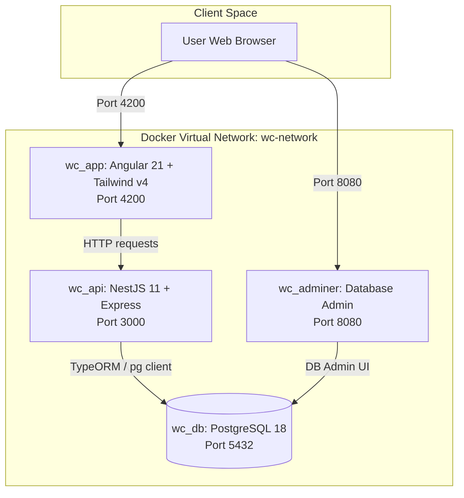

# 🏆 World Cup Prediction Portal

A full-stack, containerized web application designed for predicting football match results for the World Cup. This application is built using a modern, reactive stack: an **Angular 21** frontend powered by **Tailwind CSS v4**, a scalable **NestJS 11** backend API, and a robust **PostgreSQL 18** database.

---

## 🏗️ Architecture Overview

The application is structured as a multi-container Docker application to ensure isolated development environments and seamless deployment.



---

## 💻 Tech Stack & Port Mappings

| Service | Container Name | Port (Host:Container) | Service Type / Tech Stack | Access URL |
| :--- | :--- | :--- | :--- | :--- |
| **Frontend** | `wc_app` | `4200:4200` | Angular 21, Tailwind CSS v4, Signals, Forms | [http://localhost:4200](http://localhost:4200) |
| **Backend API** | `wc_api` | `3000:3000` | NestJS 11, TypeScript, TypeORM, Passport JWT | [http://localhost:3000](http://localhost:3000) |
| **Database** | `wc_db` | `5432:5432` | PostgreSQL 18 (Alpine) | `localhost:5432` |
| **Database Admin** | `wc_adminer` | `8080:8080` | Adminer (Database Management tool) | [http://localhost:8080](http://localhost:8080) |

---

## 🔑 Custom Authentication Flow

The application implements a custom security flow designed for local setups:

1. **Step 1: Check Email:**
   - The user enters their email on the login screen.
   - The backend checks if the email exists in the system database.

2. **Step 2A: First-Time Login:**
   - If the user has not set a password yet:
     - The backend generates a secure password configuration token.
     - The token link is logged directly to the backend application console and appended to a local log file: [api/sent-emails.txt](file:///d:/Code/worldcup/api/sent-emails.txt) in your workspace.
     - The user clicks the link to open the password setup page, creates a password, and returns to the login screen.

3. **Step 2B: Normal Login:**
   - If the user has already configured a password:
     - A password input box is shown.
     - Users can log in using their password.
     - "Remember Me" retains the session across browser restarts.

---

## 📊 Predictor Workflow & Scoring Rules

1. **Active Match Time-Lock:**
   - Users can predict scores for any match up to its kick-off time (in IST).
   - Once the match starts, predictions are locked (inputs become read-only in the frontend and are strictly validated on the backend).

2. **Scoring Rules:**
   - **30 Points:** Correct exact score (e.g., predicted `2-1` and match ended `2-1`).
   - **10 Points:** Correct match result but incorrect score (e.g., predicted `2-1` and match ended `1-0`, both wins).
   - **0 Points:** Incorrect result.

3. **Employee Standings Leaderboard:**
   - The dashboard displays a live leaderboard of all employees sorted by total points.
   - Point standings are recalculated dynamically whenever an administrator updates a fixture score.

---

## ⚙️ Administration Portal

Users with the `admin` role can access the **Admin Panel** to manage tournament data:
- **Fixture Scoring:** Enter scores for concluded fixtures. Submitting scores marks matches as `completed` and triggers point updates.
- **Manage Teams:** Add, edit, or delete teams in the database.
- **Manage Fixtures:** Add, edit, or delete fixtures.

---

## 🚀 Getting Started

### Step 1: Spin Up Containers
Run the following command at the root of the workspace to build and run all services:
```bash
docker compose up --build
```

### Step 2: Access & Credentials
Open [http://localhost:4200](http://localhost:4200) in your browser:

#### Pre-seeded Admin:
- **Email:** `admin@worldcup.com`
- **Password:** `Admin@WorldCup2026`

#### Pre-seeded Users:
- **Email:** `user1@worldcup.com` (First-time user. Enter email, retrieve password-setup link from `api/sent-emails.txt` to set password).
- **Email:** `user2@worldcup.com` (Activated user. Password: `user123`).
- **Email:** `user3@worldcup.com` (Activated user. Password: `user123`).
- **Email:** `user4@worldcup.com` (Activated user. Password: `user123`).

---

## 📂 Project Structure

```text
worldcup/
├── api/                   # NestJS 11 Backend API Source Code
│   ├── src/               
│   │   ├── admin/         # Administrative module (teams, fixtures CRUD, and scoring)
│   │   ├── auth/          # Authentication module (JWT validation & custom login flow)
│   │   ├── db/            # Seeder module containing team, match, and user datasets
│   │   ├── matches/       # Match schema entities
│   │   ├── predictions/   # Predictions endpoints, services, and entity schemas
│   │   ├── teams/         # Team schema entities
│   │   └── users/         # User profile schema and directory models
│   └── sent-emails.txt    # Local mock file containing password configuration links
│
└── app/                   # Angular 21 Frontend Source Code
    ├── src/               
    │   ├── app/           
    │   │   ├── auth/      # Auth state signals, guards, and services
    │   │   └── components/# Login, Set-Password, Dashboard, Predictor, and Admin-Panel
    │   └── styles.css     # Global stylesheets (Tailwind v4 imports)
```
